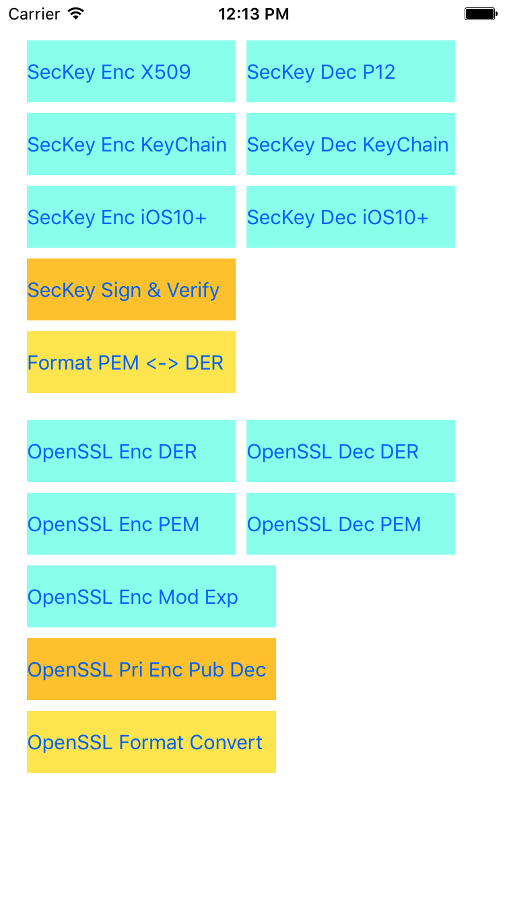

# QuickRSA
RSA Encrypt and Decrypt lib and demo for iOS (Using Security.framework and OpenSSL)


#### 1. Run script gen_rsa_key.sh to generate RSA keys.

WARNING: DO NOT RELEASE "PRIVATE KEY" IN PACKAGE(注意：切记不要把私钥一起打包发布)

```shell
$sh gen_rsa_key.sh  #Generate a peer keys of RSA
$sh test_rsa_key.sh #Test
```


#### 2. Create a RSA SecKeyRef

```objc
@interface QRSecCrypto : NSObject
//Call CFRelease() to free SecKeyRef.

//1. Public SecKeyRef from 509 Cert
+ (SecKeyRef)RSASecKeyCreatePublicWithX509CertData:(NSData *)certData;
//2. Private SecKeyRef from P12
+ (SecKeyRef)RSASecKeyCreatePrivateWithP12Data:(NSData *)p12Data password:(NSString *)password;


//3. Use Keychain
//Turn On Keychain Sharing(Project - TARGETS - Capabilitys - Keychain Sharing - Switch On).
//This API using SecItemXXX works with Keychain, may retrun nil if the Keychain can't access. In that case you can use OpenSSL instand of SecItem.

//Public SecKeyRef must use PKCS1 format data, get it form DER format use +[QRFormatConvert RSA_PUB_PKCS1FromDER:]
+ (SecKeyRef)RSASecKeyCreatePublicWithPKCS1Data:(NSData *)pkcs1Data appTag:(NSString *)appTag;
//Private SecKeyRef use DER format data directly. [DER format] == [PKCS1 format]
+ (SecKeyRef)RSASecKeyCreatePrivateWithDERData:(NSData *)derData appTag:(NSString *)appTag;


//4. For iOS 10 and later, public key or private key.
+ (SecKeyRef)RSASecKeyCreateWithDERData_iOS10:(NSData *)derData isPublic:(BOOL)isPublic __OSX_AVAILABLE(10.12) __IOS_AVAILABLE(10.0) __TVOS_AVAILABLE(10.0) __WATCHOS_AVAILABLE(3.0);
@end
```


Keychain API "SecItemAdd" and "SecItemCopyMatching" for getting SecKeyRef may return NULL randomly. In that case you can use OpenSSL instand of SecItem.(钥匙串函数"SecItemAdd"和"SecItemCopyMatching"获取SecKeyRef可能返回NULL，这样的话只能使用OpenSSL来代替)

So the func +[QRSecCrypto RSASecKeyCreatePublicWithPKCS1Data:appTag:] and +[QRSecCrypto RSASecKeyCreatePrivateWithDERData:appTag:] may return NULL too. 

If you can't accept this error, use OpenSSL instead. Or use +[QRSecCrypto RSASecKeyCreateWithDERData_iOS10:isPublic:] for iOS10 and later.

System log of SecItemXXX return NULL:
```txt
Jul  7 18:51:48 iPhone securityd[212] <Error>:  securityd_xpc_dictionary_handler TestApp[780] copy_matching Error Domain=NSOSStatusErrorDomain Code=-34018 "client has neither application-identifier nor keychain-access-groups entitlements" UserInfo={NSDescription=client has neither application-identifier nor keychain-access-groups entitlements}
Jul  7 18:51:48 iPhone TestApp[780] <Error>:  SecOSStatusWith error:[-34018] Error Domain=NSOSStatusErrorDomain Code=-34018 "client has neither application-identifier nor keychain-access-groups entitlements" UserInfo={NSDescription=client has neither application-identifier nor keychain-access-groups entitlements}
```

#### 3. RSA Enc/Dec/Sign/Verify with SecKeyRef

```objc
@interface NSData(QRSecCrypto)
//Default padding is kSecPaddingPKCS1

- (NSData *)RSAEncryptDataWithPublicKey:(SecKeyRef)publicKey;//Encrypt with public key
- (NSData *)RSADecryptDataWithPrivateKey:(SecKeyRef)privateKey;//Decrypt with private key

- (NSData *)RSASignDataWithPrivateKey:(SecKeyRef)privateKey;//Sign(Encrypt) with private key
- (BOOL)RSAVerifyWithRawData:(NSData *)rawData publicKey:(SecKeyRef)publicKey;//Verify with public key (Decrypt and Compare)
@end
```

#### 4. OpenSSL RSA Enc/Dec

```objc
@interface NSData(OpenSSL)

#if USE_OPENSSL
//Default padding is RSA_PKCS1_PADDING

//Use PEM format, Pub(Pri) Enc -> Pri(Pub) Dec
- (NSData *)OpenSSL_RSA_EncryptDataWithPEM:(NSData *)pemData isPublic:(BOOL)isPublic;//PEM key
- (NSData *)OpenSSL_RSA_DecryptDataWithPEM:(NSData *)pemData isPublic:(BOOL)isPublic;//PEM key

//Use DER format, Pub(Pri) Enc -> Pri(Pub) Dec
- (NSData *)OpenSSL_RSA_EncryptDataWithDER:(NSData *)derData isPublic:(BOOL)isPublic;//DER key
- (NSData *)OpenSSL_RSA_DecryptDataWithDER:(NSData *)derData isPublic:(BOOL)isPublic;//DER key

//Use modulus and exponent
- (NSData *)OpenSSL_RSA_DataWithPublicModulus:(NSData *)modulus exponent:(NSData *)exponent isDecrypt:(BOOL)isDecrypt;
//- (NSData *)OpenSSL_RSA_DataWithPrivateModulus:...
#endif

@end
```

#### 5. Format convert class "QRFormatConvert"

```objc
@interface QRFormatConvert : NSObject

+ (NSData *)DERFromPEM:(NSData *)pemData;//PEM to DER
+ (NSData *)PEMFromDER:(NSData *)derData header:(const char *)header;//DER to PEM, header such as PEM_STRING_RSA

#if USE_OPENSSL
//Public Key
+ (NSData *)RSA_PUB_ModulusFromDER:(NSData *)derData;   //Public key modulus
+ (NSData *)RSA_PUB_ExponentFromDER:(NSData *)derData;  //Public key exponent

+ (NSData *)RSA_PUB_PKCS1FromDER:(NSData *)derData;     //Public key PKCS1 format from DER
+ (NSData *)RSA_PUB_DERFromPKCS1:(NSData *)pkcs1Data;   //Public key DER format from PKCS1

+ (NSData *)RSA_PUB_PKCS1FromModulus:(NSData *)modulus exponent:(NSData *)exponent useDER:(BOOL)useDER; //Public key PKCS1 or DER from modulus and exponent

//Private Key
//[DER format] == [PKCS1 format]
+ (NSData *)RSA_PRI_DERFromModulus:(NSData *)modulus  //Private key DER format from components
                       pubExponent:(NSData *)pubExponent
                       priExponent:(NSData *)priExponent
                            prime1:(NSData *)prime1
                            prime2:(NSData *)prime2
                         exponent1:(NSData *)exponent1
                         exponent2:(NSData *)exponent2
                       coefficient:(NSData *)coefficient;
#endif
@end

//Hex
@interface NSData(QuickRSA)
- (NSString *)hexString;
@end

@interface NSString(QuickRSA)
- (NSData *)dataFromHexString;
@end

```


PEM <-> DER

modulus, exponent <-> DER

PKCS1 <-> DER

Data <->Hex string


#### 6. Link error

  Project Settings add "Other Linker Flags" -ObjC or -all_load

#### 7. Demo preview
<!---->


#### 8. Reference

* https://github.com/x2on/OpenSSL-for-iPhone (OpenSSL lib）
* https://github.com/StCredZero/SCZ-BasicEncodingRules-iOS
* http://www.techper.net/2012/06/01/converting-rsa-public-key-modulus-and-exponent-into-pem-file/
* http://www.jianshu.com/p/21bb11ff8e27
* https://www.openssl.org/docs/man1.0.1/crypto/i2d_RSA_PUBKEY.html
* https://gist.github.com/lvjian700/635368d6f1e421447680
* http://www.dsm.fordham.edu/~mathai/openssl.html
* http://stackoverflow.com/questions/6705928/encrypting-data-with-a-private-key-on-ios
